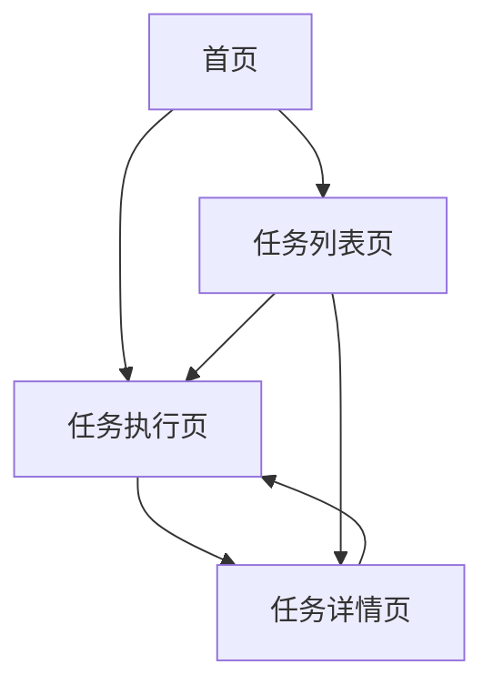

# 浏览器自动化操作工具产品需求文档

## 1. 产品概述

本产品是一个基于浏览器的智能自动化操作工具，通过自然语言指令驱动浏览器执行复杂的网页操作任务。

* 解决用户重复性网页操作的痛点，提供智能化的浏览器自动化解决方案，让用户通过简单的自然语言描述即可完成复杂的网页操作流程。

* 目标是成为个人和企业提升工作效率的必备工具，覆盖数据采集、表单填写、网页测试等多种应用场景。

## 2. 核心功能

### 2.1 用户角色

本产品无需用户注册登录，所有用户均为匿名用户，享有完整的功能权限。

### 2.2 功能模块

我们的浏览器自动化工具包含以下主要页面：

1. **首页**：任务创建区域、快捷操作入口、功能导航
2. **任务列表页**：历史任务展示、任务状态管理、操作记录查看
3. **任务执行页**：实时执行状态、操作日志显示、执行控制面板
4. **任务详情页**：详细执行记录、操作步骤回放、结果数据展示

### 2.3 页面详情

| 页面名称  | 模块名称   | 功能描述                        |
| ----- | ------ | --------------------------- |
| 首页    | 任务创建区域 | 输入目标网址、描述操作流程、选择执行参数、启动任务执行 |
| 首页    | 快捷操作入口 | 提供常用操作模板、历史任务快速重执行、小工具集合    |
| 首页    | 功能导航   | 访问任务管理、设置配置、帮助文档等功能模块       |
| 任务列表页 | 任务历史展示 | 显示所有历史任务、支持搜索筛选、按状态分类查看     |
| 任务列表页 | 任务状态管理 | 查看执行状态、重新执行任务、删除无用任务、导出任务数据 |
| 任务列表页 | 操作记录查看 | 查看详细执行日志、操作截图、错误信息诊断        |
| 任务执行页 | 实时执行状态 | 显示当前执行进度、操作步骤提示、预计完成时间      |
| 任务执行页 | 操作日志显示 | 实时更新执行日志、显示操作截图、记录异常信息      |
| 任务执行页 | 执行控制面板 | 暂停继续执行、停止任务、调整执行参数、手动干预     |
| 任务详情页 | 详细执行记录 | 完整操作时间线、每步操作详情、执行结果统计       |
| 任务详情页 | 操作步骤回放 | 可视化操作流程、步骤截图展示、操作路径分析       |
| 任务详情页 | 结果数据展示 | 提取的数据内容、执行成功率、性能指标分析        |

## 3. 核心流程

用户操作流程：

1. 用户在首页输入目标网址和操作描述
2. 系统解析自然语言指令并生成操作步骤
3. 在新标签页中自动执行浏览器操作
4. 实时记录执行过程和结果数据
5. 用户可在任务列表中查看和管理历史任务

## 4. 用户界面设计

### 4.1 设计风格

* 主色调：深蓝色(#1e40af)和浅灰色(#f8fafc)

* 辅助色：绿色(#10b981)表示成功，红色(#ef4444)表示错误，橙色(#f59e0b)表示警告

* 按钮风格：圆角矩形，具有轻微阴影效果

* 字体：系统默认字体，标题16-20px，正文14px，说明文字12px

* 布局风格：卡片式设计，顶部导航栏，左侧功能菜单

* 图标风格：线性图标，简洁现代，支持深色和浅色主题

### 4.2 页面设计概览

| 页面名称  | 模块名称   | UI元素                                       |
| ----- | ------ | ------------------------------------------ |
| 首页    | 任务创建区域 | 居中大卡片布局，白色背景，圆角边框，输入框采用浅灰色边框，蓝色聚焦状态，大号提交按钮 |
| 首页    | 快捷操作入口 | 网格布局的小卡片，每个卡片包含图标和文字，悬停时轻微上浮效果             |
| 任务列表页 | 任务历史展示 | 表格布局，斑马纹行背景，状态标签采用不同颜色，支持排序和筛选             |
| 任务执行页 | 实时执行状态 | 进度条显示，步骤列表，右侧控制面板，深色背景突出重要信息               |
| 任务详情页 | 详细执行记录 | 时间线布局，左侧时间轴，右侧详细内容，支持展开折叠                  |

### 4.3 响应式设计

只需要实现桌面web端，不需要考虑移动端和触点操作
