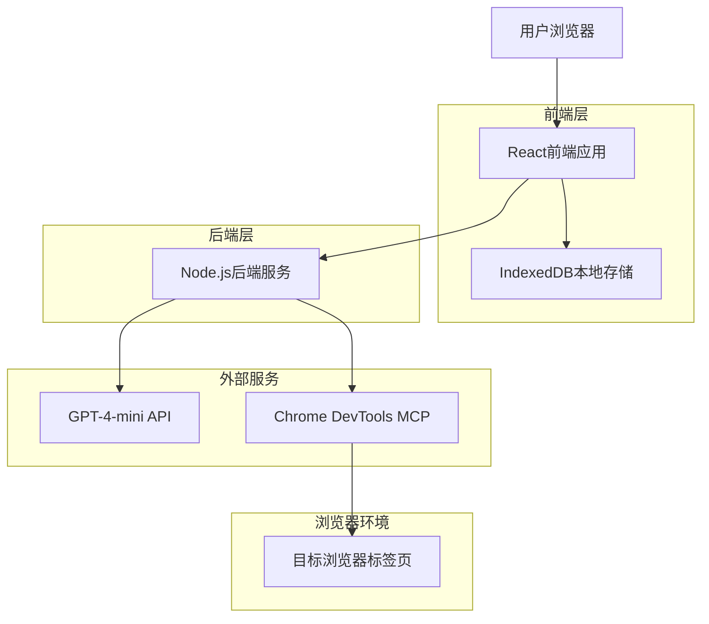
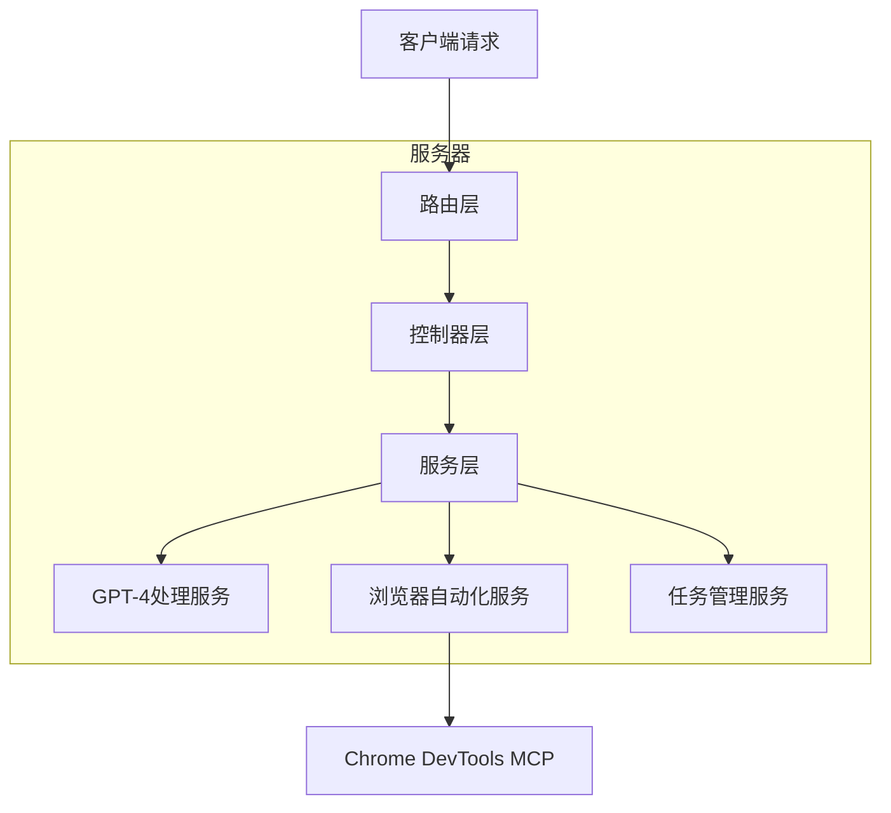
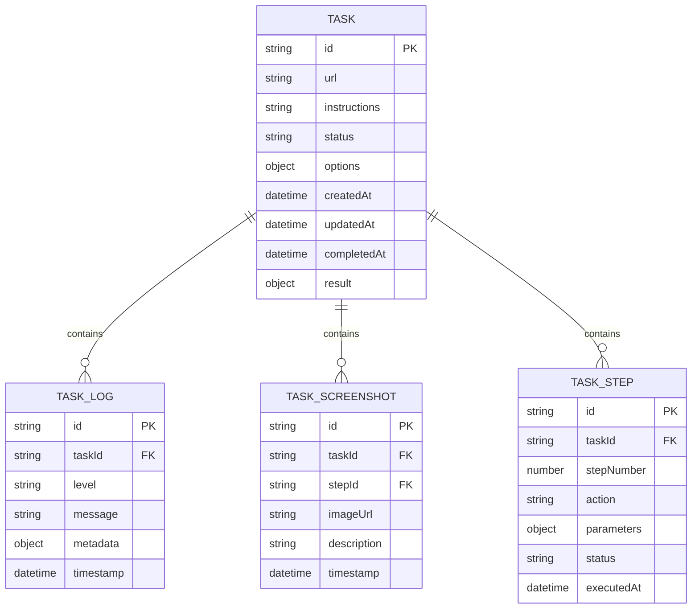

# 浏览器自动化操作工具技术架构文档

## 1. 架构设计



## 2. 技术描述

* 前端：React\@18 + Tailwind CSS\@3 + Vite

* 后端：Node.js\@23 + Express\@4

* 自然语言处理：GPT-4-mini API

* 浏览器自动化：chrome-devtools-mcp协议

* 本地存储：IndexedDB

* 构建工具：Vite

## 3. 路由定义

| 路由                 | 用途                |
| ------------------ | ----------------- |
| /                  | 首页，任务创建和快捷操作入口    |
| /tasks             | 任务列表页，显示历史任务和管理功能 |
| /tasks/:id         | 任务详情页，显示特定任务的详细信息 |
| /tasks/:id/execute | 任务执行页，实时显示任务执行状态  |

## 4. API定义

### 4.1 核心API

任务管理相关

```
POST /api/tasks/create
```

请求参数：

| 参数名称         | 参数类型   | 是否必需  | 描述       |
| ------------ | ------ | ----- | -------- |
| url          | string | true  | 目标网页地址   |
| instructions | string | true  | 自然语言操作指令 |
| options      | object | false | 执行选项配置   |

响应参数：

| 参数名称   | 参数类型   | 描述       |
| ------ | ------ | -------- |
| taskId | string | 创建的任务ID  |
| status | string | 任务状态     |
| steps  | array  | 解析后的操作步骤 |

示例：

```json
{
  "url": "https://example.com",
  "instructions": "登录网站并填写用户信息表单",
  "options": {
    "timeout": 30000,
    "screenshot": true
  }
}
```

任务执行控制

```
POST /api/tasks/:id/execute
```

请求参数：

| 参数名称   | 参数类型   | 是否必需 | 描述                           |
| ------ | ------ | ---- | ---------------------------- |
| action | string | true | 执行动作：start/pause/resume/stop |

响应参数：

| 参数名称        | 参数类型   | 描述      |
| ----------- | ------ | ------- |
| status      | string | 执行状态    |
| currentStep | number | 当前执行步骤  |
| progress    | number | 执行进度百分比 |

任务状态查询

```
GET /api/tasks/:id/status
```

响应参数：

| 参数名称        | 参数类型   | 描述                                    |
| ----------- | ------ | ------------------------------------- |
| status      | string | 任务状态：pending/running/completed/failed |
| logs        | array  | 执行日志列表                                |
| screenshots | array  | 操作截图列表                                |
| result      | object | 执行结果数据                                |

任务历史查询

```
GET /api/tasks
```

查询参数：

| 参数名称   | 参数类型   | 是否必需  | 描述        |
| ------ | ------ | ----- | --------- |
| page   | number | false | 页码，默认1    |
| limit  | number | false | 每页数量，默认20 |
| status | string | false | 状态筛选      |

响应参数：

| 参数名称  | 参数类型   | 描述   |
| ----- | ------ | ---- |
| tasks | array  | 任务列表 |
| total | number | 总数量  |
| page  | number | 当前页码 |

## 5. 服务器架构图



## 6. 数据模型

### 6.1 数据模型定义



### 6.2 IndexedDB数据定义

任务表 (tasks)

```javascript
// 创建对象存储
const taskStore = db.createObjectStore('tasks', { keyPath: 'id' });
taskStore.createIndex('status', 'status', { unique: false });
taskStore.createIndex('createdAt', 'createdAt', { unique: false });
taskStore.createIndex('url', 'url', { unique: false });

// 任务数据结构
const taskSchema = {
  id: 'string', // UUID
  url: 'string', // 目标网址
  instructions: 'string', // 操作指令
  status: 'string', // pending/running/completed/failed/cancelled
  options: 'object', // 执行选项
  steps: 'array', // 操作步骤列表
  logs: 'array', // 执行日志
  screenshots: 'array', // 截图列表
  result: 'object', // 执行结果
  createdAt: 'datetime',
  updatedAt: 'datetime',
  completedAt: 'datetime'
};
```

执行日志表 (logs)

```javascript
// 创建对象存储
const logStore = db.createObjectStore('logs', { keyPath: 'id' });
logStore.createIndex('taskId', 'taskId', { unique: false });
logStore.createIndex('timestamp', 'timestamp', { unique: false });
logStore.createIndex('level', 'level', { unique: false });

// 日志数据结构
const logSchema = {
  id: 'string',
  taskId: 'string',
  level: 'string', // info/warn/error/debug
  message: 'string',
  metadata: 'object',
  timestamp: 'datetime'
};
```

截图表 (screenshots)

```javascript
// 创建对象存储
const screenshotStore = db.createObjectStore('screenshots', { keyPath: 'id' });
screenshotStore.createIndex('taskId', 'taskId', { unique: false });
screenshotStore.createIndex('timestamp', 'timestamp', { unique: false });

// 截图数据结构
const screenshotSchema = {
  id: 'string',
  taskId: 'string',
  stepNumber: 'number',
  imageData: 'blob', // Base64编码的图片数据
  description: 'string',
  timestamp: 'datetime'
};
```

